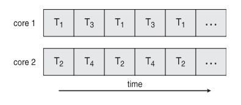
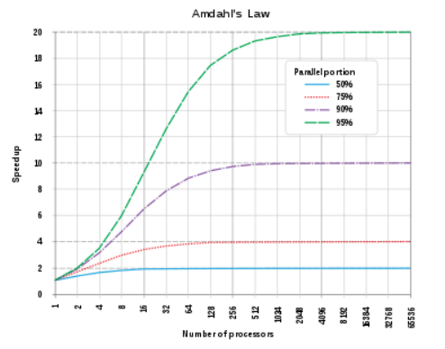
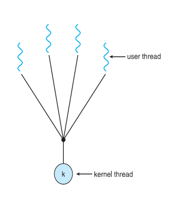
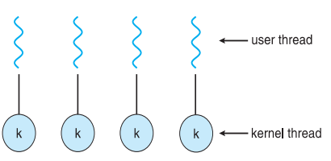
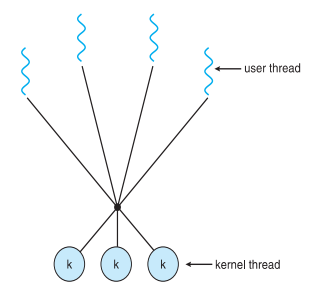
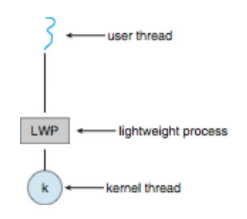
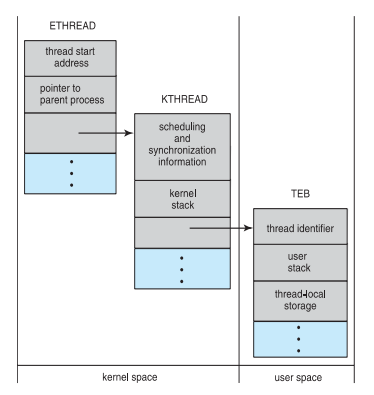

<div align="center">
  <h1 style="text-align: center;font-weight: bold">PRAKTIKUM 10<br>SISTEM OPERASI</h1>
  <h4 style="text-align: center;">Dosen Pengampu : Dr. Ferry Astika Saputra, S.T., M.Sc.</h4>
</div>
<br />
<div align="center">
  
  <h3 style="text-align: center;">Disusun Oleh : </h3>
  <p style="text-align: center;">
    <strong>Ale Perdana Putra Darmawan (3123500027) </strong><br>
  </p>
<h3 style="text-align: center;line-height: 1.5">Politeknik Elektronika Negeri Surabaya<br>Departemen Teknik Informatika Dan Komputer<br>Program Studi Teknik Informatika<br>2023/2024</h3>
  <hr><hr>
</div>

## Daftar Isi
- [Daftar Isi](#daftar-isi)
- [Dasar Teori](#dasar-teori)
  - [Thread](#thread)
- [Multicore programming](#multicore-programming)
  - [Concurrency vs. Parallelism](#concurrency-vs-parallelism)
  - [User Threads and Kernel Threads](#user-threads-and-kernel-threads)
- [Multithreading Models](#multithreading-models)
  - [Many to One](#many-to-one)
  - [One to One](#one-to-one)
  - [Many to Many](#many-to-many)
  - [Two-level Model](#two-level-model)
- [Thread Libraries](#thread-libraries)
  - [Pthreads](#pthreads)
  - [Java thread](#java-thread)
- [Implicit Threading](#implicit-threading)
  - [Thread Pools](#thread-pools)
  - [OpenMP](#openmp)
  - [Grand Central Dispatch](#grand-central-dispatch)
- [Threading Issues](#threading-issues)
  - [Penanganan Sinyal](#penanganan-sinyal)
  - [Pembatalan Thread](#pembatalan-thread)
  - [Thread-Local Storage](#thread-local-storage)
  - [Scheduler Activations](#scheduler-activations)
- [Operating System Example](#operating-system-example)
  - [Windows Threads](#windows-threads)
  - [Windows Threads Data Structures](#windows-threads-data-structures)
  - [Linux Threads](#linux-threads)
- [Pertanyaan dan jawaban](#pertanyaan-dan-jawaban)
- [Kesimpulan](#kesimpulan)
- [Referensi](#referensi)

## Dasar Teori
### Thread 
merupakan sebuah status eksekusi (running, ready, dll.), sering disebut dengan lightweight process. Merupakan unit dasar dari penggunaan CPU, yang terdiri dari thread_id, program counter, register set, dan stack. Sebuah thread berbagi code section, data section, dan sumber daya sistem operasi dengan Thread lain yang dimiliki oleh proses yang sama. Thread merupakan cara dari komputer untuk menjalankan dua atau lebih task dalam waktu bersamaan, sedangkan multithreading adalah cara komputer untuk membagi-bagi pekerjaan yang dikerjakan sebagian-sebagian dengan cepat

## Multicore programming
Sistem Multicore atau Multiprosesor memberikan tekanan pada programmer, tantangan-tantangannya meliputi:
- Memisahkan aktivitas
- Mencapai keseimbangan
- Memecah data
- Ketergantungan data
- Pengujian dan debugging

Parallelism menyiratkan bahwa sistem dapat melakukan lebih dari satu tugas secara bersamaan.

Concurrency mendukung kemajuan lebih dari satu tugas.
- Pada single processor/core, scheduler menyediakan concurrency.

Jenis-jenis parallelism:
- Data parallelism – mendistribusikan subset data yang sama ke beberapa core, operasi yang sama dilakukan pada masing-masing.
- Task parallelism – mendistribusikan thread ke berbagai core, setiap thread melakukan operasi yang unik.

Seiring bertambahnya jumlah thread, dukungan arsitektural untuk threading juga meningkat.
- CPU memiliki core serta hardware threads.
- Pertimbangkan Oracle SPARC T4 dengan 8 core, dan 8 hardware threads per core.

### Concurrency vs. Parallelism
Concurrent
Concurrent adalah istilah asing dari Bahasa Inggris yang bila diterjemahkan ke dalam Bahasa Indonesia bermakna “bersamaan”. Secara umum, Concurrency ini merujuk pada kemampuan sesuatu untuk dapat memproses dua atau lebih pekerjaan yang terjadi di waktu bersamaan tanpa ada urutan yang baku.
eksekusi concurrent pada sistem single-core:<br>


Parallelism
Singkatnya bisa dikatakan bahwa parallelism adalah proses memecah permasalahan menjadi tugas yang lebih kecil yang dapat dilakukan secara bersamaan.
parallelism pada sistem multi-core:<br>


Perbedaan single thread proses dan multi thread proses
Single-threading : Sebuah proses tradisional atau heavyweight process mempunyai thread tunggal yang berfungsi sebagai pengendali.<br>


Multi-threading : Sebuah proses dengan thread yang banyak dan mengerjakan lebih dari satu tugas pada satu satuan waktu.<br>


Amdahl's law:
Mengidentifikasi peningkatan kinerja dari menambahkan inti pemrosesan tambahan ke aplikasi yang memiliki komponen serial dan paralel.

<br>
- S adalah bagian serial.
- N adalah jumlah inti pemrosesan.
Artinya, jika aplikasi 75% paralel dan 25% serial, berpindah dari 1 ke 2 inti pemrosesan menghasilkan peningkatan kecepatan 1,6 kali.
Ketika N mendekati tak terhingga, peningkatan kecepatan mendekati 1 / S.

grafik amdahl's law<br>


### User Threads and Kernel Threads
Thread Pengguna: manajemen dilakukan oleh pustaka thread tingkat pengguna.
Tiga pustaka thread utama: 
- POSIX Pthreads
- Thread Windows
- Thread Java

Thread Kernel: Didukung oleh Kernel. hampir semua sistem operasi umum memakai thread kernel, termasuk: 
- Windows
- Solaris
- Linux
- Tru64 UNIX
- Mac OS X

## Multithreading Models
ada empat macam multithreading model, yaitu:
- Many-to-One
- One-to-One
- Many-to-Many
- Two-level model

### Many to One
<br>
Dalam model ini, banyak thread tingkat pengguna dipetakan ke satu thread kernel. Hal ini menyebabkan jika satu thread mengalami blocking, maka semua thread lain juga terblokir. Keterbatasan ini juga berarti bahwa beberapa thread tidak dapat dijalankan secara paralel pada sistem multicore, karena hanya satu thread yang dapat berada dalam kernel pada satu waktu. Model ini saat ini jarang digunakan.
Contoh:
- Solaris Green Threads 
- GNU Portable Threads

### One to One
<br>
Dalam model ini, setiap thread tingkat pengguna dipetakan ke thread kernel yang sesuai. Proses pembuatan thread tingkat pengguna secara otomatis akan menciptakan thread kernel. Model ini memungkinkan lebih banyak konkurensi dibandingkan dengan model many-to-one, namun jumlah thread per proses terkadang dibatasi karena overhead yang terkait.
Contoh:
- Windows
- Linux
- Solaris 9 dan keatas

### Many to Many
<br>
Model Many-to-Many memungkinkan banyak user-level threads dipetakan ke banyak kernel threads, sehingga memungkinkan sistem operasi untuk membuat jumlah kernel threads yang memadai. Model ini diterapkan pada sistem seperti Solaris sebelum versi 9 dan Windows dengan paket ThreadFiber.

### Two-level Model
<br>
Mirip dengan Many to Many, Tetapi model ini memungkinkan thread pengguna untuk terikat ke thread kernel.
Contoh 
- IRIX
- HP-UX
- Tru64 UNIX
- Solaris 8 dan kebawah

## Thread Libraries
Thread libraries menyediakan antarmuka pemrograman aplikasi (API) untuk membuat dan mengelola thread. Ada dua cara utama dalam mengimplementasikannya. Pertama, dengan menggunakan perpustakaan yang sepenuhnya berada di ruang pengguna (user space). Kedua, dengan menggunakan perpustakaan tingkat kernel yang didukung oleh sistem operasi.

### Pthreads
Pthreads ini dapat disediakan baik di tingkat pengguna (user-level) maupun tingkat kernel. Sebagai standar POSIX (IEEE 1003.1c), API ini digunakan untuk pembuatan dan sinkronisasi thread. Namun, perlu dicatat bahwa ini hanya berupa spesifikasi, bukan implementasi. Implementasi dari perpustakaan thread bergantung pada pengembang perpustakaan tersebut. Model ini umumnya digunakan pada sistem operasi UNIX seperti Solaris, Linux, dan macOS.

Contoh pthreads:
```c
#include <pthread.h>
#include <stdio.h>

int sum; /* data yang dibagikan oleh thread-thread */
void *runner (void *param); /* thread akan memanggil fungsi ini */

int main(int argc, char *argv[])
{
    pthread_t tid; /* identifikasi thread */
    pthread_attr_t attr; /* atribut thread */

    /* cek jumlah argumen dan nilai argumen */
    if (argc != 2) {
        fprintf(stderr, "usage: a.out <integer value>\n");
        return -1;
    }

    if (atoi(argv[1]) < 0) {
        fprintf(stderr, "%d must be >= 0\n", atoi(argv[1]));
        return -1;
    }

    /* inisialisasi atribut thread */
    pthread_attr_init(&attr);

    /* buat thread baru dan jalankan fungsi runner dengan argumen argv[1] */
    pthread_create(&tid, &attr, runner, (void *) &atoi(argv[1]));

    /* tunggu thread selesai */
    pthread_join(tid, NULL);

    /* cetak pesan saat main selesai */
    printf("sum = %d\n", sum);
}

/* thread akan memulai kontrol dalam fungsi ini */
void *runner(void *param)
{
int it, upper = atoi(param);
sum = 0;

for ( i = 1; i <= upper; i++)
sum += i;
pthread_exit(0);
}
```

Program multithreaded windows dalam c:
```c
#include <windows.h>
#include <stdio.h>

DWORD Sum; /* data dibagikan oleh thread-thread */

DWORD WINAPI Summation(LPVOID Param)
{
    DWORD Upper = *(DWORD*)Param;
    for (DWORD i = 0; i <= Upper; i++)
        Sum += i;
    return 0;
}

int main(int argc, char *argv[])
{
    DWORD ThreadId;
    HANDLE ThreadHandle;
    int Param;

    if (argc != 2) {
        fprintf(stderr, "an integer parameter is required\n");
        return -1;
    }

    Param = atoi(argv[1]);
    if (Param < 0) {
        fprintf(stderr, "an Integer >= 0 is required\n");
        return -1;
    }

    /* buat thread */
    ThreadHandle = CreateThread(
        NULL, /* atribut keamanan default */ 
        0, /* ukuran stack default */ 
        Summation, /* fungsi thread */ 
        &Param, /* parameter untuk fungsi thread */ 
        0,  /* flag pembuatan default */ 
        &ThreadId
    );
    /* mengembalikan fungsi thread */

    if (ThreadHandle == NULL) {
        /* tunggu thread selesai */
        WaitForSingleObject(ThreadHandle, INFINITE);
        /* tutup handle thread */
        CloseHandle(ThreadHandle);
        printf("Sum is: %d\n", Sum);
    }
}
```

### Java thread 
dikelola oleh JVM (Java Virtual Machine) dan biasanya diimplementasikan menggunakan model thread yang disediakan oleh sistem operasi yang mendasarinya. Thread dalam Java dapat dibuat dengan: 
```java
public interface Runnable
{
public abstract void run();
}
```
- memperpanjangkan kelas Thread.
- mengimplementasikan antarmuka Runnable.


Java Multithreaded Program
```java
class Sum {
    private int sum; // Ini adalah nilai integer yang akan menyimpan jumlah.

    // Metode ini mengembalikan nilai dari jumlah.
    public int getSum() {
        return sum;
    }

    // Metode ini mengatur nilai dari jumlah.
    public void setSum(int sum) {
        this.sum = sum;
    }
}

// Kelas Summation mengimplementasikan antarmuka Runnable, yang berarti dapat dijalankan sebagai thread terpisah.
class Summation implements Runnable {
    private int upper; // Ini adalah batas atas dari penjumlahan.
    private Sum sumValue; // Ini adalah objek Sum yang akan menyimpan hasil penjumlahan.

    // Ini adalah konstruktor untuk kelas Summation. Konstruktor ini menerima batas atas penjumlahan dan objek Sum yang akan menyimpan hasilnya.
    public Summation(int upper, Sum sumValue) {
        this.upper = upper;
        this.sumValue = sumValue;
    }

    // Ini adalah metode run yang akan dieksekusi ketika thread dimulai. Ini menghitung jumlah semua angka hingga batas atas dan mengatur hasilnya dalam objek Sum.
    public void run() {
        int sum = 0; // Ini adalah variabel yang akan menyimpan jumlah.
        for (int i = 0; i <= upper; i++) { // Loop ini menghitung jumlah semua angka hingga batas atas.
            sum += i;
        }
        sumValue.setSum(sum); // Ini mengatur hasil penjumlahan dalam objek Sum.
    }
}

// Ini adalah kelas utama yang menjalankan program.
public class Driver
{
    // Ini adalah metode utama yang dieksekusi ketika program dijalankan.
    public static void main(String[] args) {
        // Ini memeriksa apakah program dijalankan dengan argumen baris perintah.
        if (args.length > 0) {
        }
        // Ini memeriksa apakah argumen baris perintah pertama adalah integer non-negatif.
        if (Integer.parseInt(args[0]) < 0)
            // Jika tidak, ini mencetak pesan kesalahan dan keluar dari program.
            System.err.println(args[0] + " harus >= 0.");
        else {
            // Jika iya, ini membuat objek Sum baru untuk menyimpan hasil penjumlahan.
            Sum sumObject = new Sum();
            // Ini mendapatkan batas atas penjumlahan dari argumen baris perintah pertama.
            int upper = Integer.parseInt(args[0]);
            // Ini membuat thread baru dengan objek Summation baru yang akan menghitung jumlah.
            Thread thrd=new Thread(new Summation (upper, sumObject));
            // Ini memulai thread.
            thrd.start();
            try {
                // Ini menunggu thread untuk selesai.
                thrd.join();
                // Ini mencetak hasil penjumlahan.
                System.out.println("Jumlah dari "+upper+" adalah "+sumObject.getSum());
            } catch (InterruptedException e) { }
        }
    }
}
```

## Implicit Threading
Semakin populer seiring bertambahnya jumlah thread, program menjadi lebih sulit untuk benar dengan thread eksplisit. Pembuatan dan pengelolaan thread dilakukan oleh kompiler dan pustaka run-time daripada oleh programmer.
Ada tiga metode yang telah dieksplorisasi:
- Thread Pools
- OpenMP
- Grand Central Dispatch
Metode lain termasuk Microsoft Threading Building Blocks (TBB), paket java.util.concurrent

### Thread Pools
Membuat sejumlah thread dalam sebuah pool di mana mereka menunggu pekerjaan.
Keuntungannya:
- Biasanya sedikit lebih cepat untuk melayani permintaan dengan thread yang sudah ada daripada membuat thread baru
- Memungkinkan jumlah thread dalam aplikasi untuk dibatasi sesuai dengan ukuran pool
- Memisahkan tugas yang akan dilakukan dari mekanisme pembuatan tugas memungkinkan strategi yang berbeda untuk menjalankan tugas. contoh: Tugas dapat dijadwalkan untuk dijalankan secara berkala

Windows API mendukung thread pools:
```
DWORD WINAPI PoolFunction(AVOID Param) {
/*
* fungsi ini menjalankan thread yang berbeda.
*/
}
```

### OpenMP
- Sekumpulan direktif kompiler dan sebuah API untuk C, C++, FORTRAN
- Menyediakan dukungan untuk pemrograman paralel dalam lingkungan memori bersama
- Mengidentifikasi wilayah paralel – blok kode yang dapat dijalankan secara paralel

#pragma omp parallel 
Membuat thread sebanyak jumlah core

#pragma omp parallel for 
```
for(i=0;i<N;i++) { 
c[i] = a[i] + b[i]; 
}
```
Menjalankan for loop secara paralel

contoh kode:
```
#include <omp.h>
#include <stdio.h>

int main(int argc, char *argv[])
{
/* kode sekuensial */

#pragma omp parallel
{
printf("I am parallel region.");
}
/* kode sekuensial */

return 0;
}
```

### Grand Central Dispatch
- Teknologi Apple untuk sistem operasi Mac OS X dan iOS.
- Ekstensi untuk bahasa C, C++, API, dan pustaka run-time.
- Memungkinkan identifikasi bagian paralel.
- Mengelola sebagian besar detail threading.
- Block berada dalam “^{ }” - ˆ{ printf("I am a block"); } 
- Block yang ditempatkan dalam dispatch queue ditugaskan ke thread yang tersedia dalam thread pool saat dihapus dari queue.

Ada dua jenis dispatch queues:
- serial – blocks dihapus dalam urutan FIFO, queue adalah per proses, disebut main queue
  - Pemrogram dapat membuat serial queue tambahan dalam program
- concurrent – dihapus dalam urutan FIFO tetapi beberapa dapat dihapus sekaligus
  - Tiga system wide queues dengan prioritas rendah, default, tinggi

contoh kode:
```
dispatch.queue.t queue = dispatch.get.global.queue
(DISPATCH.QUEUE.PRIORITY.DEFAULT, 0);

dispatch.async(queue, ^{ printf("I am a block."); });
```

## Threading Issues
- Semantik dari fork() dan exec() system calls
- Penanganan sinyal
  - Sinkron dan asinkron
- Pembatalan thread dari target thread
  - Asinkron atau ditunda
- Penyimpanan lokal thread
- Scheduler Activations
Semantik dari fork() dan exec()
- Apakah fork() menduplikasi hanya thread yang memanggil atau semua thread?
  - Beberapa UNIX memiliki dua versi fork
- exec() biasanya bekerja seperti biasa – menggantikan proses yang berjalan termasuk semua thread

### Penanganan Sinyal
- Sinyal digunakan dalam sistem UNIX untuk memberi tahu sebuah proses bahwa sebuah peristiwa tertentu telah terjadi.
- Sebuah signal handler digunakan untuk memproses sinyal
  1. Sinyal dihasilkan oleh peristiwa tertentu
  2. Sinyal dikirim ke sebuah proses
  3. Sinyal ditangani oleh salah satu dari dua signal handlers:
    1. default
    2. user-defined
- Setiap sinyal memiliki handler default yang dijalankan kernel saat menangani sinyal
  - User-defined signal handler dapat menggantikan default
  - Untuk single-threaded, sinyal dikirim ke proses
- Di mana sinyal harus dikirim untuk multi-threaded?
  - Mengirim sinyal ke thread yang relevan dengan sinyal tersebut
  - Mengirim sinyal ke setiap thread dalam proses
  - Mengirim sinyal ke thread tertentu dalam proses
  - Menetapkan thread spesifik untuk menerima semua sinyal untuk proses

### Pembatalan Thread
- Mengakhiri sebuah thread sebelum selesai
- Thread yang akan dibatalkan adalah target thread
- Dua pendekatan umum:
  - Pembatalan asinkron mengakhiri target thread segera
  - Pembatalan ditunda memungkinkan target thread secara periodik memeriksa apakah ia harus dibatalkan
- Kode Pthread untuk membuat dan membatalkan sebuah thread:

| Mode | State | Type |
|---|---|---|
off | Disabled | - |
Deferred | Enabled | Deferred |
Asynchronous | Enabled | Asynchronous |

- Memanggil permintaan pembatalan thread meminta pembatalan, tetapi pembatalan yang sebenarnya bergantung pada keadaan thread
Jika thread memiliki pembatalan yang dinonaktifkan, pembatalan tetap tertunda sampai thread mengaktifkannya
- Tipe default adalah ditunda
  - Pembatalan hanya terjadi ketika thread mencapai titik pembatalan
    > contoh, pthread_testcancel()
    > Kemudian handler cleanup dipanggil
- Pada sistem Linux, pembatalan thread ditangani melalui sinyal

### Thread-Local Storage
- Penyimpanan lokal thread (Thread-local storage/TLS) memungkinkan setiap thread memiliki salinan datanya sendiri
- Berguna ketika Anda tidak memiliki kontrol atas proses pembuatan thread (misalnya, saat menggunakan thread pool)
- Berbeda dari variabel lokal
  - Variabel lokal hanya terlihat selama satu pemanggilan fungsi
  - TLS terlihat di seluruh pemanggilan fungsi
- Mirip dengan data statis
  - TLS unik untuk setiap thread

### Scheduler Activations
<br>
- Model M:M dan model dua tingkat memerlukan komunikasi untuk menjaga jumlah thread kernel yang dialokasikan ke aplikasi secara tepat
- Biasanya menggunakan struktur data perantara antara thread pengguna dan thread kernel – lightweight process (LWP)
  - Tampak seperti prosesor virtual di mana proses dapat menjadwalkan thread pengguna untuk dijalankan
  - Setiap LWP terhubung ke thread kernel
  - Berapa banyak LWP yang harus dibuat?
- Scheduler activations menyediakan upcalls - mekanisme komunikasi dari kernel ke upcall handler di pustaka thread
- Komunikasi ini memungkinkan aplikasi untuk menjaga jumlah thread kernel yang tepat

## Operating System Example
- Windows Threads
- Linux Threads

### Windows Threads
- Windows mengimplementasikan Windows API – API utama untuk Win 98, Win NT, Win 2000, Win XP, dan Win 7
- Mengimplementasikan pemetaan one-to-one, level kernel
- Setiap thread berisi:
  - Sebuah id thread
  - Set register yang merepresentasikan status prosesor
  - Stack pengguna dan kernel yang terpisah untuk saat thread berjalan dalam mode pengguna atau mode kernel
  - Area penyimpanan data pribadi yang digunakan oleh pustaka run-time dan pustaka tautan dinamis (DLLs)
- Set register, stack, dan area penyimpanan pribadi dikenal sebagai konteks thread
- Struktur data utama dari sebuah thread meliputi:
  - ETHREAD (executive thread block) – mencakup pointer ke proses tempat thread berada dan ke KTHREAD, di ruang kernel
  - KTHREAD (kernel thread block) – informasi penjadwalan dan sinkronisasi, stack mode kernel, pointer ke TEB, di ruang kernel
  - TEB (thread environment block) – id thread, stack mode pengguna, penyimpanan lokal thread, di ruang pengguna

### Windows Threads Data Structures
<br>

### Linux Threads
Flag | Pengertian
---|---
CLONE_FS | Informasi sistem file dibagikan
CLONE_VM | Tempat memory yang sama dibagikan
CLONE_SIGHAND | Penanganan sinyal dibagikan
CLONE_FILES | Kumpulan file yang terbuka dibagikan

- Di Linux, thread disebut sebagai tasks.
- Pembuatan thread dilakukan melalui sistem panggilan clone().
- clone() memungkinkan task anak untuk berbagi ruang alamat dengan task induk (proses)
  - Flags mengontrol perilaku
- struct task_struct menunjuk ke struktur data proses (berbagi atau unik)

## Pertanyaan dan jawaban
1. Berikan tiga contoh pemrograman di mana multithreading memberikan kinerja yang lebih baik daripada solusi single-threaded.
Jawaban:
a. Web server yang melayani setiap permintaan dalam thread terpisah.
b. Aplikasi parallelized seperti matrix multiplication di mana bagian-bagian berbeda dari matriks dapat dikerjakan secara paralel.
c. Program GUI interaktif seperti debugger di mana satu thread digunakan untuk memantau input pengguna, thread lain mewakili aplikasi yang berjalan, dan thread ketiga memantau kinerja.

2. Apa dua perbedaan antara user-level threads dan kernel-level threads? Dalam kondisi apa salah satu jenis lebih baik daripada yang lain?
Jawaban:
a. User-level threads tidak diketahui oleh kernel, sedangkan kernel mengetahui kernel threads.
b. Pada sistem yang menggunakan pemetaan M:1 atau M:N, user threads dijadwalkan oleh thread library dan kernel menjadwalkan kernel threads.
c. Kernel threads tidak harus terkait dengan sebuah proses sedangkan setiap user thread milik sebuah proses. Kernel threads umumnya lebih mahal untuk dipelihara daripada user threads karena mereka harus diwakili dengan struktur data kernel.

3. Jelaskan tindakan yang diambil oleh kernel untuk context-switch antara kernel-level threads.
Jawaban:
Context switching antara kernel threads biasanya memerlukan penyimpanan nilai register CPU dari thread yang sedang di-switch out dan pemulihan register CPU dari thread baru yang dijadwalkan.

4. Apa sumber daya yang digunakan ketika sebuah thread dibuat? Bagaimana mereka berbeda dari yang digunakan ketika sebuah proses dibuat?
Jawaban:
Karena sebuah thread lebih kecil daripada sebuah proses, pembuatan thread biasanya menggunakan lebih sedikit sumber daya daripada pembuatan proses. Membuat sebuah proses memerlukan pengalokasian process control block (PCB), sebuah struktur data yang cukup besar. PCB mencakup peta memori, daftar file yang terbuka, dan variabel lingkungan. Pengalokasian dan pengelolaan peta memori biasanya merupakan aktivitas yang paling memakan waktu. Membuat baik user maupun kernel thread melibatkan pengalokasian struktur data kecil untuk menyimpan set register, stack, dan prioritas.

5. Asumsikan bahwa sebuah sistem operasi memetakan user-level threads ke kernel menggunakan model many-to-many dan pemetaan dilakukan melalui LWPs. Selain itu, sistem memungkinkan pengembang untuk membuat real-time threads untuk digunakan dalam sistem real-time. Apakah perlu untuk mengikat real-time thread ke LWP? Jelaskan.
Jawaban:
Ya. Timing sangat penting untuk aplikasi real-time. Jika sebuah thread ditandai sebagai real-time tetapi tidak diikat ke LWP, thread mungkin harus menunggu untuk dihubungkan ke LWP sebelum berjalan. Pertimbangkan jika sebuah real-time thread sedang berjalan (terhubung ke LWP) dan kemudian mengalami blocking (misalnya harus melakukan I/O, di-preempt oleh thread real-time dengan prioritas lebih tinggi, menunggu lock eksklusi mutual, dll). Saat real-time thread diblokir, LWP yang terhubung dengannya telah dialokasikan ke thread lain. Ketika real-time thread dijadwalkan untuk berjalan lagi, ia harus menunggu terlebih dahulu untuk dihubungkan ke LWP. Dengan mengikat LWP ke real-time thread, Anda memastikan bahwa thread dapat berjalan dengan penundaan minimal setelah dijadwalkan.

6. Apa itu Thread?
Jawaban:
Thread adalah unit dasar pemanfaatan CPU yang membentuk dasar sistem komputer multithread.

7. Apa keuntungan dari Multithreading?
Jawaban:
Multithreading menawarkan beberapa keuntungan seperti responsivitas yang lebih baik, berbagi sumber daya yang lebih mudah, ekonomi karena pembuatan thread lebih murah daripada pembuatan proses, dan skalabilitas yang memungkinkan proses memanfaatkan arsitektur multiprosesor.

## Kesimpulan
Thread merupakan unit dasar dari penggunaan CPU. Setiap thread memiliki thread ID, program counter, register set, dan stack. Thread juga sering disebut sebagai lightweight process. Sebuah thread berbagi code section, data section, dan sumber daya sistem operasi dengan thread lain yang dimiliki oleh proses yang sama.

## Referensi
Sumber 1: https://gustibgsbayu.medium.com/sistem-operasi-thread-c7fb4a35d89a
Sumber 2: https://www.researchgate.net/figure/Graph-of-Amdahls-Law_fig1_309529380