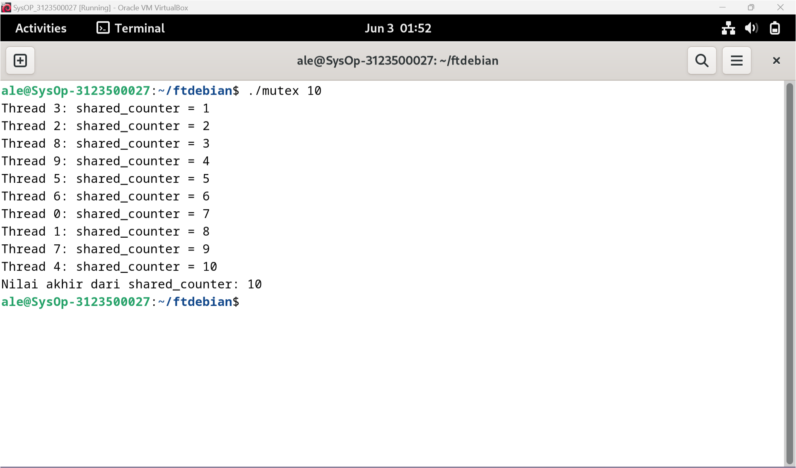

<div align="center">
  <h1 style="text-align: center;font-weight: bold">PRAKTIKUM 12<br>SISTEM OPERASI</h1>
  <h4 style="text-align: center;">Dosen Pengampu : Dr. Ferry Astika Saputra, S.T., M.Sc.</h4>
</div>
<br />
<div align="center">
  
  <h3 style="text-align: center;">Disusun Oleh : </h3>
  <p style="text-align: center;">
    <strong>Marieta Nona Alfani (312350026) </strong><br>
    <strong>Ale Perdana Putra Darmawan (3123500027) </strong><br>
    <strong>Kanisius Keru Okok Dinggon(3123500028)</strong>
  </p>
<h3 style="text-align: center;line-height: 1.5">Politeknik Elektronika Negeri Surabaya<br>Departemen Teknik Informatika Dan Komputer<br>Program Studi Teknik Informatika<br>2023/2024</h3>
  <hr><hr>
</div>

## Daftar Isi
- [Daftar Isi](#daftar-isi)
- [Dasar Teori](#dasar-teori)
- [Program](#program)
- [Kesimpulan](#kesimpulan)
- [Referensi](#referensi)

## Dasar Teori
Mutual Exclusion (Mutex) adalah konsep dalam pemrograman yang mengatur akses simultan ke sumber daya bersama. Ketika dua thread bekerja pada data yang sama secara bersamaan, mutex bertindak sebagai kunci yang memastikan hanya satu thread yang dapat mengakses sumber daya tersebut pada satu waktu tertentu. Dengan demikian, mutex mencegah race conditions dan memastikan bahwa bagian kritis dari kode, di mana proses atau utas mengakses sumber daya bersama, hanya dapat diakses oleh satu utas pada suatu waktu. 

## Program
Program 1 (tanpa mutex):
```c
// beri komentar
#include <pthread.h>
#include <stdio.h>
#include <stdlib.h>

// Global variable
int shared_counter = 0;

// beri komentar
void *thread_function(void *thread_id)
{
    //menginisiasi threat
    pthread_t tid = (pthread_t)thread_id;

    // Increment global var
    shared_counter++;

    // beri komentar
    printf("Thread %ld: nilai shared_counter = %d\n", (long)tid,
           shared_counter);

    // beri komentar
    return NULL;
}

int main(int argc, char *argv[])
{
    // beri komentar
    if (argc != 2)
    {
        printf("Gunakan: %s <number_of_threads>\n", argv[0]);
        exit(EXIT_FAILURE);
    }
    // mengambil nilai masukan jumlha dari thread melalui argumen
    int num_threads = atoi(argv[1]);

    // beri komentar
    pthread_t *threads = (pthread_t *)malloc(
        num_threads * sizeof(pthread_t));

    // membuat threads
    for (int i = 0; i < num_threads; i++)
    {
        int status = pthread_create(&threads[i], NULL,
                                    thread_function,
                                    (void *)threads[i]);
        if (status != 0)
        {
            printf("Error: pthread_create() returned error "
                   "code %d\n",
                   status);
            exit(EXIT_FAILURE);
        }
    }

    // Wait for all threads to finish execution
    for (int i = 0; i < num_threads; i++)
    {
        int status = pthread_join(threads[i], NULL);
        if (status != 0)
        {
            printf("Error: pthread_join() returned error "
                   "code %d\n",
                   status);
            exit(EXIT_FAILURE);
        }
    }

    // Free the memory allocated for the thread IDs
    free(threads);

    // Print the final value of the shared counter
    printf("Nilai akhir dari shared counter: %d\n",
           shared_counter);

    // Return success
    return 0;
}
```

Output:


Analisa: Dalam program ini, penyelesaian proses dijalankan pada 1 thread yang mengakibatkan race condition yang dimana beberapa proses merebutkan sebuah thread untuk menyelesaikan proses tersebut.

Program 2 (dengan mutex):
```c
#include <pthread.h>
#include <stdio.h>
#include <stdlib.h>


int shared_counter = 0;

pthread_mutex_t shared_counter_mutex = PTHREAD_MUTEX_INITIALIZER;


void *thread_function(void *thread_id)
{
    
    long tid = (long)thread_id;

  
    pthread_mutex_lock(&shared_counter_mutex);

    
    shared_counter++;


    printf("Thread %ld: shared_counter = %d\n", tid,
           shared_counter);

    pthread_mutex_unlock(&shared_counter_mutex);

   
    return NULL;
}

int main(int argc, char *argv[])
{
   
    if (argc != 2)
    {
        printf("Penggunaan %s <number_of_threads>\n", argv[0]);
        exit(EXIT_FAILURE);
    }

   
    int num_threads = atoi(argv[1]);

    pthread_t *threads = (pthread_t *)malloc(
        num_threads * sizeof(pthread_t));


    for (int i = 0; i < num_threads; i++)
    {
        int status = pthread_create(
            &threads[i], NULL, thread_function, (void *)i);
        if (status != 0)
        {
            printf("Error: pthread_create() returned error "
                   "code %d\n",
                   status);
            exit(EXIT_FAILURE);
        }
    }

   
    for (int i = 0; i < num_threads; i++)
    {
        int status = pthread_join(threads[i], NULL);
        if (status != 0)
        {
            printf("Error: pthread_join() returned error "
                   "code %d\n",
                   status);
            exit(EXIT_FAILURE);
        }
    }

    // Free the memory untuk thread IDs
    free(threads);

    
    printf("Nilai akhir dari shared_counter: %d\n",
           shared_counter);

    // Return success
    return 0;

}
```

Output:</br>


Analisa: Program ini bekerja sama seperti program 1 yang dimana proses akan diselesaikan dalam thread. tetapi pada program ini ada tambahan mutual exclusion atau mutex yang dimana sebuah proses akan dialokasikan ke thread dan proses tersebut akan dilock dan akan diunlock setelah proses selesai. Fungsi mutex sendiri agar proses tidak terjadi race condition dalam 1 thread melainkan setiap proses dialokasikan kedalam thread masing masing.

## Kesimpulan
Kesimpulannya, Mutex berfungsi sebagai variabel kunci yang digunakan untuk mengunci proses dalam thread agar tidak terjadinya race condition dengan proses lain.

## Referensi
Sumber 1: https://rifqimulyawan.com/literasi/mutual-exclusion-mutex/