<div align="center">
  <h1 style="text-align: center;font-weight: bold">PRAKTIKUM 8<br>SISTEM OPERASI</h1>
  <h4 style="text-align: center;">Dosen Pengampu : Dr. Ferry Astika Saputra, S.T., M.Sc.</h4>
</div>
<br />
<div align="center">
  
  <h3 style="text-align: center;">Disusun Oleh : </h3>
  <p style="text-align: center;">
    <strong>Marieta Nona Alfani (312350026) </strong><br>
    <strong>Ale Perdana Putra Darmawan (3123500027) </strong><br>
    <strong>Kanisius Keru Okok Dinggon(3123500028)</strong>
  </p>
<h3 style="text-align: center;line-height: 1.5">Politeknik Elektronika Negeri Surabaya<br>Departemen Teknik Informatika Dan Komputer<br>Program Studi Teknik Informatika<br>2023/2024</h3>
  <hr><hr>
</div>

## Daftar Isi
1. [Dasar Teori](#Dasar-teori)
2. [Bash - Variable](#Bash---Variable)
3. [Bash - Loop File](#Bash---Loop-File)
4. [Bash - Comments](#Bash---Comments)
5. [Bash - Array](#Bash---Array)
6. [Bash - Expansion](#Bash---Expansion)
7. [Bash - Conditional Expression](#Bash---Conditional-Expression)
8. [Bash - Case Statements](Bash---Case-Statements)
9. [Bash - Special Characters](#Bash---Special-Characters)
10. [Kesimpulan](#Kesimpulan)
11. [Referensi](#Referensi)

## Dasar Teori
- Shell
adalah penerjemah baris perintah, Ini adalah aplikasi untuk memberikan perintah ke berbagai sistem operasi seperti Linux, Unix, dan Mac.

- Bash
adalah versi shell yang disempurnakan, lapisan antara panggilan fungsi pengguna dan sistem operasi. 

Pengguna mengetikkan perintah melalui baris perintah atau kumpulan perintah yang juga disebut skrip. 

<h3>Persyaratan</h3>

Untuk mengikuti kursus ini, Anda harus memiliki pemahaman dasar tentang bahasa komputer, dan hal-hal berikut diperlukan:
- Sistem operasi rasa Linux
- Pengetahuan dasar tentang bahasa pemrograman apa pun 

<h3>Apa itu Bash?</h3>

Bash, kependekan dari Bourne Again Shell, adalah penerjemah shell baris perintah dan bahasa skrip sumber terbuka. Ini menafsirkan perintah yang dimasukkan pengguna, baik secara interaktif atau dari file skrip. 

Ini berfungsi sebagai antarmuka untuk memanggil perintah, memungkinkan panggilan fungsi sistem.

Ada dua jenis mode bash:
- Mode interaktif: Juga disebut penerjemah perintah, memungkinkan eksekusi perintah di terminal. Ini mengeksekusi perintah secara berurutan jika ada beberapa perintah.
- Mode non-interaktif: Ini merujuk pada skrip, memungkinkan Anda menulis sintaksis Bash yang berisi rangkaian beberapa perintah untuk eksekusi skrip.

<h3>Apa perbedaan antara Bash dan shell</h3>
Shell, alias Bourne Shell, adalah penerjemah baris perintah untuk OS Unix dan Linux. Bash, alias Bourne Again Shell, adalah versi yang disempurnakan.

<h3>Untuk apa skrip bash digunakan?</h3>

Skrip Bash memiliki banyak kasus penggunaan, termasuk:
- Menulis skrip untuk mengotomatiskan tugas pemrograman.
- Menyinkronkan tugas untuk menyalin file.
- Menjalankan tugas cron untuk penjadwalan.

<h3>Bagaimana cara menulis kode di bash?</h3>

Untuk menulis kode dalam skrip Bash, ikuti langkah-langkah berikut:
- Di terminal, buat file menggunakan ```vi test.sh```.
- Menambahkan ```#!/bin/bash``` di bagian atas file.
- Tambahkan beberapa cuplikan kode shell.
- Simpan file shell dengan ```.sh``` ekstensi.
- Jalankan skrip shell menggunakan ```./test.sh``` perintah di terminal.

<h3>Apakah Bash merupakan bahasa koding?</h3>
Bash menjalankan perintah dari terminal atau file. Ini adalah bahasa pemrograman yang beroperasi pada sistem operasi kernel Unix/Linux, berisi semua fitur untuk menulis kode lengkap.

Bash adalah tipe shell khusus yang menerima masukan dari perintah, menjalankan kode, dan memproses masukan, serta mengembalikan hasilnya. 

<h3>Jenis Shell</h3>
Ada berbagai jenis shell di OS Unix.

| Tipe Shell | Alias | Baris pertama |
|---|---|---|
| SH | Bourne Shell |	#!/bin/sh |
| Bash | Bourne Again Shell | #!/bin/bash |
| cshell | C shell | #!/bin/csh | 
| tcsh | TENEX C shell | #!/bin/tcsh |
| ksh | Korn shell | #!/bin/ksh |

<h3>Perbedaan antara Command Line dan Script di bash</h3>

Mari kita lihat perbedaan antara baris perintah dan skrip
Opsi baris perintah
- Baris perintah memiliki prompt yang menerima masukan dari pengguna.
- Perintah tidak disimpan ke file.
- Ini hanya mendukung satu perintah pada satu waktu. 

File skrip
- Mendukung banyak perintah dalam satu file.
- Prompt masih dapat ditulis dalam file skrip.
- Hanya satu baris dalam sebuah file yang dijalankan secara berurutan.

## Bash - Variable
<h3>Variabel Bash Shell</h3>

Variabel merupakan elemen dasar dari bahasa pemrograman apa pun. Pemrograman skrip shell dan bash menawarkan variabel, seperti bahasa lainnya.

Variabel berfungsi sebagai wadah yang digunakan untuk menyimpan data dalam pemrograman. Ini mencakup penunjuk ke lokasi memori data.

Deklarasikan variabel : Untuk membuat variabel, Anda harus memberikan nilai padanya. 

```bash
variableName=VariableValue
```

```VariableName``` Ini adalah nama variabel, yang dapat berisi kombinasi huruf apa saja (a sampai z, A sampai Z), angka (0 sampai 9), dan garis bawah (_).

```VariableValue``` adalah nilai yang disimpan dalam variabel, dan dapat berupa string angka atau boolean. Simbol sama dengan (=) digunakan untuk memberikan nilai pada suatu variabel.

Misalnya:

```bash
AGE=25
```

Sebuah variabel bernama AGEdibuat dan diberi nilai 25.

<h3>Cara Mengakses Variabel di Bash</h3>
Setelah mendeklarasikan dan menetapkan nilai ke variabel, Anda dapat mengaksesnya menggunakan simbol dolar ( $) diikuti dengan nama variabel. 

```bash
AGE=25
echo $AGE
```

Kode di atas mendeklarasikan variabel bernama ```AGE``` dengan nilai ```25``` dan kemudian menggunakan ```echo``` untuk menampilkan nilai ```AGE``` variabel. Itu ```dollar``` simbol sebelum nama variabel sangat penting untuk mengakses nilainya.

<h3>Variabel readonly Bash Shell</h3> 
Setelah variabel diberi nilai, Anda dapat mengubahnya ke nilai baru menggunakan operator penugasan =. 

```bash
AGE=25
echo $AGE
AGE=35
echo $AGE
```

Output:

```bash
25
35
```

Percobaan 1:
- [Alfani - Variable 1](#Alfani---Variable-1)
- [Ale - Variable 1](#Ale---Variable-1)
- [Kanisius - Variable 1](#Kanisius---Variable-1)

## Alfani - Variable 1


## Ale - Variable 1


## Kanisius - Variable 1

Bagaimana Anda membuat variabel tidak dapat diperbarui?

Itu readonlykata kunci mencegah variabel diperbarui, secara efektif mengubahnya menjadi a constant. 

```bash
AGE=25
echo $AGE
readonly AGE
AGE=35
echo $AGE
```

AGE adalah sebuah batasan, menetapkan nilai baru menimbulkan kesalahan, dan pesan kesalahannya adalah AGE: is read-only.

Output: 

```bash
25
 line 6: AGE: is read-only
```

Percobaan 2:
- [Alfani - Variable 2](#Alfani---Variable-2)
- [Ale - Variable 2](#Ale---Variable-2)
- [Kanisius - Variable 2](K#anisius---Variable-2)

## Alfani - Variable 2

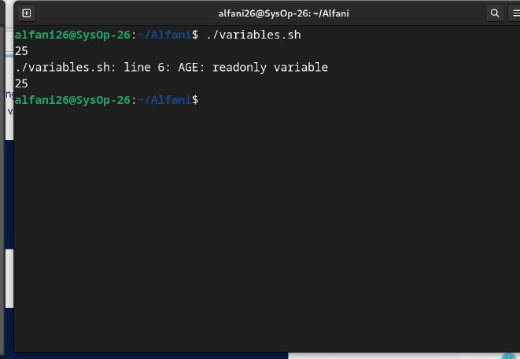

## Ale - Variable 2


## Kanisius - Variable 2

<h3>Variabel unset Bash</h3>

Itu ```unset``` kata kunci membantu menghilangkan nilai dari variabel yang ditentukan. Variabel tetap dapat diakses tetapi mencetak nilai kosong.

```bash
AGE=25
echo $AGE
unset AGE
echo "empty":$AGE
```

Output:

```bash
25
empty:
```
Percobaan 3:
- [Alfani - Variable 3](#Alfani---Variable-3)
- [Ale - Variable 3](#Ale---Variable-3)
- [Kanisius - Variable 3](#Kanisius---Variable-3)

## Alfani - Variable 3


## Ale - Variable 3
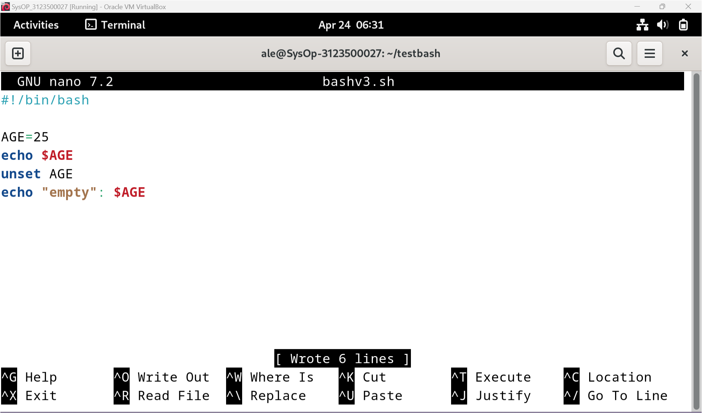


## Kanisius - Variable 3


Kode di atas,
- pertama-tama setel variabel AGE ke 25, cetak nilainya,
- lalu batalkan penggunaannya ```unset``` AGE.
- Selanjutnya, Bash mencetak “empty” diikuti dengan nilai AGE, yang sekarang muncul sebagai ruang kosong. 

<h3>Lingkup Variabel</h3>
Setiap variabel yang dideklarasikan harus memiliki ruang lingkup, yang menentukan di mana variabel tersebut dapat digunakan dalam program.

Misalnya, jika suatu variabel dideklarasikan di dalam suatu fungsi, maka variabel tersebut hanya tersedia di dalam fungsi tersebut dan tidak dapat diakses di luar fungsi tersebut.

Cakupan variabel di Bash dapat didefinisikan dengan dua cara:
- Variabel global.
- Variabel lokal. 

<h3>Variabel Global Bash</h3>
Variabel yang dideklarasikan dalam skrip shell disebut sebagai variabel global.

Variabel global dapat diakses dalam suatu fungsi atau blok bersarang apa pun dari file skrip shell.

Variabel default yang dideklarasikan dalam file skrip disebut variabel global.

```bash
setAge() {
    echo "Inside Function Age: $AGE"
}
AGE=40
setAge
echo "Script Age: $AGE"
```

Output:

```bash
Inside Function Age: 40
Script Age: 40
```

Percobaan 4:
- [Alfani - Variable 4](#Alfani---Variable-4)
- [Ale - Variable 4](#Ale---Variable-4)
- [Kanisius - Variable 4](#Kanisius---Variable-4)

## Alfani - Variable 4
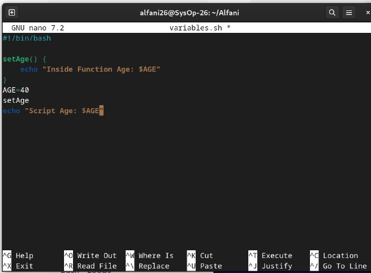


## Ale - Variable 4

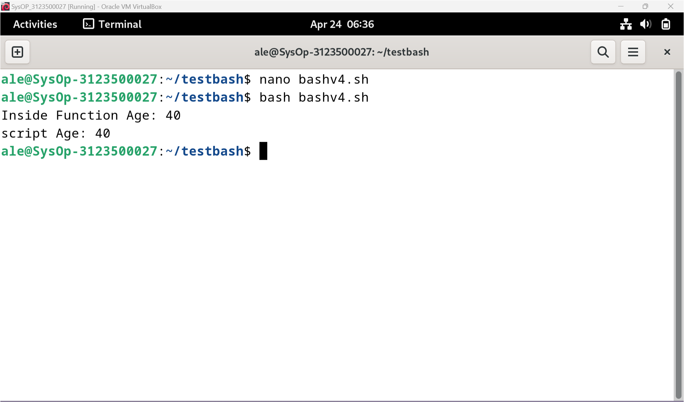

## Kanisius - Variable 4

<h3>Bash variabel Lokal</h3>
Variabel lokal dideklarasikan di dalam blok kode atau fungsi. Cakupan variabel-variabel ini hanya terlihat di dalam blok tempat variabel-variabel tersebut dideklarasikan.

Sintaks: 

```
local variablename=variablevalue
```

Dalam sintaks ini, variabel dideklarasikan dan ditugaskan dengan ```local``` kata kunci.

```bash
setAge() {
    local AGE=35
    echo "Local Variable Age: $AGE"
}
AGE=40
setAge
echo "Global Age: $AGE"
```

Output:

```bash
Local Variable Age: 25
Global Age: 40
```

Percobaan 5:
- [Alfani - Variable 5](#Alfani---Variable-5)
- [Ale - Variable 5](#Ale---Variable-5)
- [Kanisius - Variable 5](#Kanisius---Variable-5)

## Alfani - Variable 5


## Ale - Variable 5


## Kanisius - Variable 5

Variabel lokal dideklarasikan di dalam suatu fungsi dan hanya terlihat di dalam fungsi tersebut. Variabel yang dideklarasikan di luar fungsi disebut variabel global dan tersedia untuk semua fungsi.

<h3>Pengetikan variabel</h3>
Skrip Bash bukan bahasa yang diketik, namun Anda dapat mendeklarasikan variabel dengan tipe data menggunakan perintah deklarasi Berdasarkan jenis variabelnya, memungkinkan jenis datanya.

```bash
declare options variablename=value
```

variabel dideklarasikan dan diberi nilai.</br>
Opsi berisi opsi untuk membuat tipe variabel</br>
Array: Untuk membuat variabel array</br>
mendeklarasikan -a variabel= </br>

| Variable | Tipe Sintaks | Keterangan |
|---|---|---|
| Array |	mendeklarasikan variabel -a |	mendeklarasikan variabel array terindeks yang menyimpan string |
| Associated Array | mendeklarasikan variabel -A |	Array yang terkait |
| Integer |	mendeklarasikan variabel -i |	nilai numerik untuk disimpan dalam variabel |
| Readonly | mendeklarasikan variabel -r | variabel readonly, tidak dapat diubah atau unset | 
| Export | mendeklarasikan variabel -x | ekspor variabel dan digunakan oleh semua proses anak |

<h3>Tampilkan variabel Lingkungan di Bash</h3>
Di Bash, ada dua jenis perintah untuk mencetak variabel lingkungan.
- Perintah ```printenv```
- Perintah ```env```

Kedua perintah ini mencantumkan semua variabel lingkungan terminal.

<h3>Konvensi penamaan variabel</h3>
- Variabel dibaca dengan mengawalinya dengan simbol ```$```.
- Nama variabel terdiri dari huruf, angka, atau garis bawah.
- Variabel peka huruf besar-kecil; misalnya, test dan Test dianggap sebagai dua variabel berbeda dalam skrip.
- Meskipun nama variabel biasanya ditulis dalam HURUF BESAR, Anda dapat membuatnya menggunakan huruf UPPER atau LOWER jika diperlukan. Dan variabel Lingkungan dan Shell keduanya dalam huruf besar.
- Nama variabel tidak boleh mengandung spasi
- Nama-nama biasanya harus camelCase. Contoh firstName

<h3>Variabel shell</h3>
Variabel shell adalah variabel yang diatur oleh shell, bukan oleh pengguna. Ini diperlukan oleh shell agar dapat bekerja dengan lancar 

| Variabel | Keterangan |
|---|---|
PWD | Direktori kerja saat ini
Set-Location | Ubah direktori kerja ke direktori baru
Rename-Item | Ganti nama file
IFS | Pemisah Bidang Internal secara default adalah spasi, diatur oleh Shell, Digunakan untuk pemisahan string
PATH | Berisi jalur perintah yang dipisahkan titik koma, Dikonfigurasi untuk mencari perintah
UID | Mencetak nomor Identifikasi Pengguna
Home |	Direktori beranda pengguna saat ini 

## Bash - Loop File
Terkadang, Anda ingin membaca konten file dengan pemrograman bash.
<h3>Bagaimana cara membaca file demi baris di bash Shell?</h3>
- menggunakan perulangan while

```bash
#!/bin/bash
while IFS= read -r line; do
   echo "$line"
done <filename.txt
```

Percobaan:
- [Alfani - Loop File](#Alfani---Loop-File)
- [Ale - Loop File](#Ale---Loop-File)
- [Kanisius - Loop File](#Kanisius---Loop-File)

## Alfani - Loop File
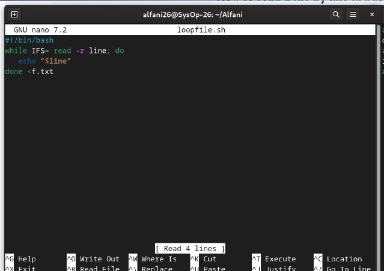


## Ale - Loop File
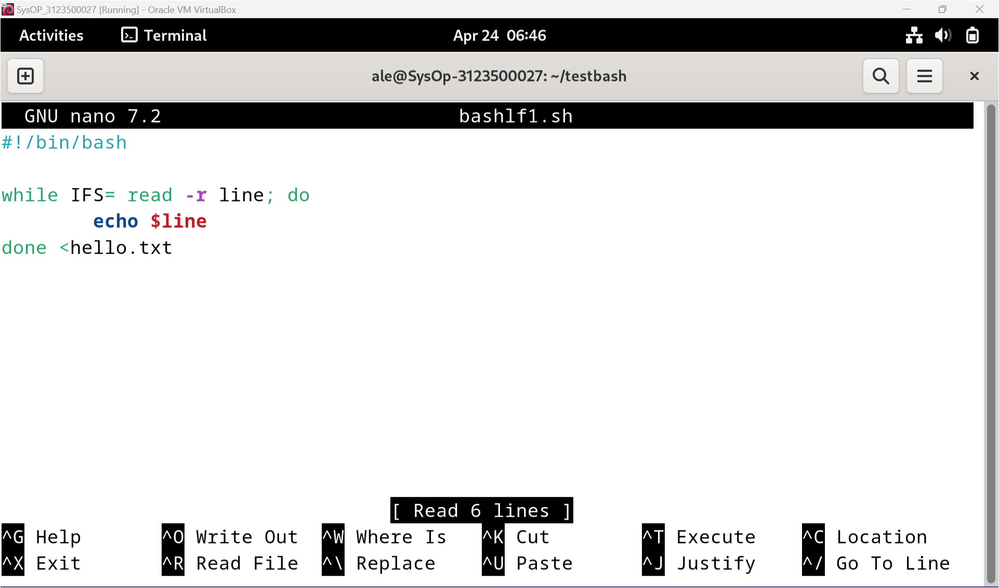


## Kanisius - Loop File


## Bash - Comments
```Comments``` adalah pernyataan kode yang berisi teks yang dapat dibaca pengguna yang dilewati shell selama eksekusi. Setiap bahasa pemrograman menyertakan fitur komentar, yang memberikan deskripsi baris kode atau pernyataan.

Komentar sebaris dalam kode membantu pengembang dalam mengedit dan memahami kode dengan lebih baik.

Bahasa skrip bash memungkinkan Anda menggunakan jenis komentar berikut.
- Komentar tunggal
- Komentar multi-baris 

Komentar berguna bagi manusia, kode ditulis untuk scripting.

<h3>Komentar satu baris di bash shell</h3>
Komentar satu baris dalam skrip shell dilambangkan dengan # simbol di awal setiap baris.

Komentar ini mencakup string yang memberikan informasi tentang baris kode terkait dalam skrip shell.

Penting untuk menempatkan komentar satu baris pada baris terpisah untuk kejelasan.

Untuk komentar sebaris, gunakan simbol # di awal komentar. Komentar satu baris selalu dimulai dengan # simbol.

Sintaks:

```bash
# Single-line comments
```

Ruang kosong setelah # simbol tidak akan muncul di output. Berikut ini adalah contoh komentar satu baris dalam skrip shell. 

```bash
# Single-line comments.
AGE=45
echo "Age:$AGE" ## printing age inline comment
```

Percobaan 1:
- [Alfani - Comments 1](#Alfani---Comments-1)
- [Ale - Comments 1](#Ale---Comments-1)
- [Kanisius - Comments 1](#Kanisius---Comments-1)

## Alfani - Comments 1
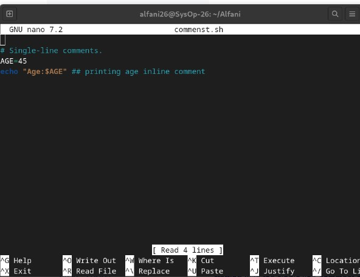
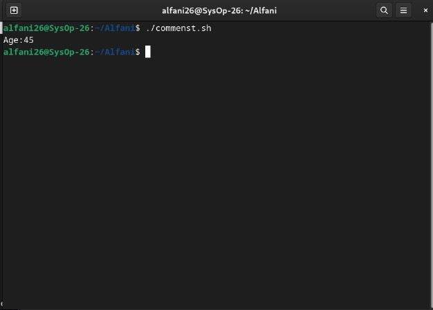

## Ale - Comments 1
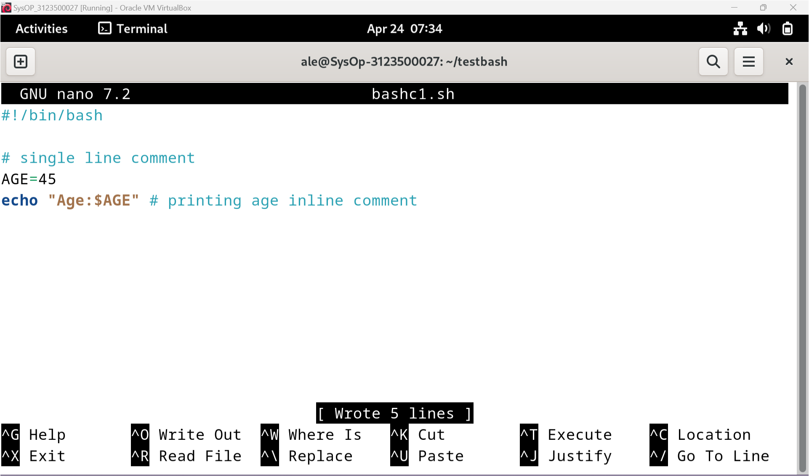


## Kanisius - Comments 1


<h3>Komentar multi-Baris dalam skrip shell</h3>
Komentar multi-baris melibatkan penggunaan lebih dari satu baris untuk komentar.

Cara pertama untuk membuat komentar multi-baris adalah dengan memanfaatkan komentar satu baris yang setiap barisnya dimulai dengan simbol komentar satu baris.

Sintaks: 

```bash
# Line1 comments
# Line1 comments
# Line1 comments
```

Cara kedua untuk membuat komentar multi-baris adalah dengan mengapit beberapa baris di dalam (```:```) Dan (```'```).

Sintaks ini melibatkan:

- Komentar dimulai dengan titik dua (```:```) diikuti dengan ```'```.
- Ini diikuti oleh beberapa baris komentar.
- Komentar diakhiri dengan ```'```.

Berikut sintaksnya: 

```bash
: '
multiline comments example1
multiline comments example2
multiline comments example3
'
```

Berikut adalah contoh Komentar Multi-Baris:
```bash
: '
multiline comments example1
multiline comments example2
multiline comments example3
'
echo "testing multi-line comments"
```

Percobaan 2:
- [Alfani - Comments 2](#Alfani---Comments-2)
- [Ale - Comments 2](#Ale---Comments-2)
- [Kanisius - Comments 2](#Kanisius---Comments-2)

## Alfani - Comments 2


## Ale - Comments 2
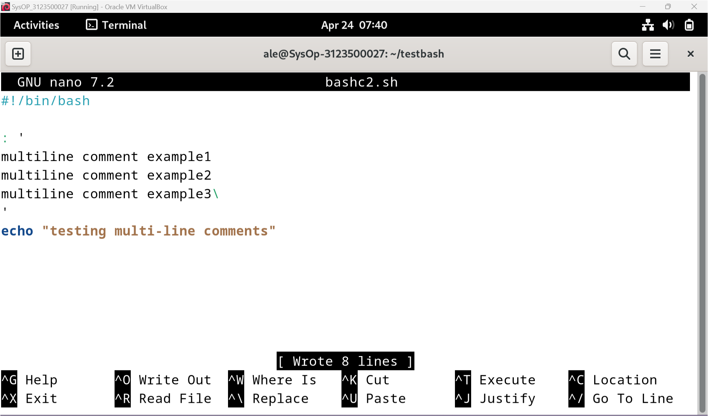
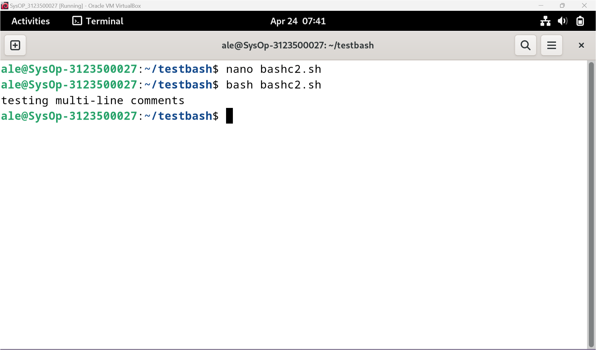

## Kanisius - Comments 2


Hal ini berguna untuk memasukkan lebih banyak teks yang mencakup beberapa baris, juga melayani tujuan dokumentasi. 

## Bash - Array
Array di shell adalah variabel yang menyimpan lebih dari satu nilai.

Misalkan, Anda memiliki daftar nomor 1 2 3.. 10 dan ingin menyimpan nomor-nomor ini di Shell Script.

Tanpa array, Anda harus mendeklarasikan sebagai berikut:

```bash
let number1=1
let number1=1
...
...
let number10=10
```

Iterasinya sulit dan jika kita ingin menyimpan 100 angka, itu sangat sulit.

Jadi, Anda bisa menggunakan array yang merujuk ke satu variabel dan menyimpannya.

<h3>Bagaimana cara mendeklarasikan dan membuat array?</h3>

Ada dua jenis array yang bisa kita buat:
- indexed array: elemen array disimpan dengan indeks mulai dari nol.
- associated array: array disimpan dengan pasangan nilai kunci.

<h3>pendeklerasian sebuah array</h3>
Untuk membuat array, kita perlu mendeklarasikan sebuah array. 

```bash
declare -a array; # indexed array
declare -A array; # associative array
```

ebuah array dideklarasikan dengan kata kunci ```declare``` dengan opsi ```-a``` atau ```-A```.

contoh indexed array Dalam hal ini, nilai Array disimpan dengan indeks=0 dan seterusnya. ini dibuat dengan opsi ```declare``` Dan ```-a```.

```bash
declare -a array
array=(one two three)
```

Array ini adalah penyimpanan dengan indeks=0, ditambah 1 sebagai berikut.

```bash
array[0]=one
array[1]=two
array[2]=three
```

contoh associated array Dalam hal ini, nilai Array disimpan dengan kunci. ini dibuat dengan opsi ```declare``` Dan ```-A```.

```bash
declare -A array
array=(one two three)
```

Dalam array ini terdapat penyimpanan dengan indeks=0, ditambah 1 sebagai berikut:

```bash
array[key1]=one
array[key2]=two
array[key3]=three
```

Contoh pemberian nilai kedalam array:

```bash
array=(1,2,3,4)
```

jika ingin memberikan nilai tanpa mendeklarasikan array:
```bash
arrayvariable[index]=value
```

Artinya, itu arrayvariable dideklarasikan dan diberi indeks array dengan nilai. 

Array diindeks nol berdasarkan nol pada panjang array -1 indeks=0 - mengembalikan elemen pertama indeks=-1 mengembalikan elemen terakhir. 

Array dapat berisi angka, string, dan campurannya.

<h3>Mengakses nilai array</h3>
Array berisi indeks untuk mendapatkan elemen. Elemen array dapat diakses menggunakan sintaks di bawah ini.

```bash
${array_name[index]}
```

<h3>mendeklarasikan array angka dan pengulangan</h3>
Array dapat berisi angka Contoh ini berisi array angka dan loop for untuk dicetak.

```bash
nums=(1 3 12)
for i in "${nums[@]}"
do
  echo "$i"
done
```

Output:

```bash
1
3
12
```

Percobaan 1:
- [Alfani - Array 1](#Alfani---Array-1)
- [Ale - Array 1](#Ale---Array-1)
- [Kanisius - Array 1](#Kanisius---Array-1)

## Alfani - Array 1

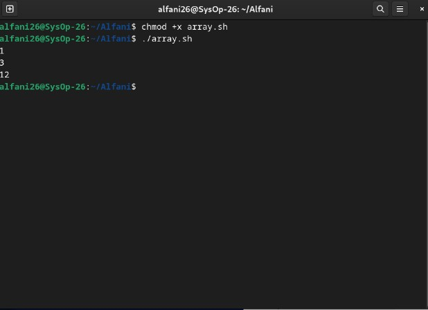

## Ale - Array 1


## Kanisius - Array 1


<h3>mendeklarasikan Array string dan pengulangan</h3>
Array dapat berisi angka Contoh ini berisi array angka dan loop for untuk dicetak.

```bash
numbers=("element1" "element2" "element3")
for i in "${numbers[@]}"
do
  echo "$i"
done
```

Output:

``` bash
element1
element2
element3
```

Percobaan 2:
- [Alfani - Array 2](#Alfani---Array-2)
- [Ale - Array 2](#Ale---Array-2)
- [Kanisius - Array 2](#Kanisius---Array-2)

## Alfani - Array 2


## Ale - Array 2


## Kanisius - Array 2


<h3>Mengakses elemen pertama dalam array</h3>
Dalam elemen Array, indeks elemen Pertama adalah nol, dan array[0] mengembalikan elemen pertama.

```bash
numbers=("element1" "element2" "element3")

echo ${numbers[0]}
echo ${numbers}
```

Output:

```bash
element1
element1
```

Percobaan 3:
- [Alfani - Array 3](#Alfani---Array-3)
- [Ale - Array 3](#Ale---Array-3)
- [Kanisius - Array 3](#Kanisius---Array-3)

## Alfani - Array 3
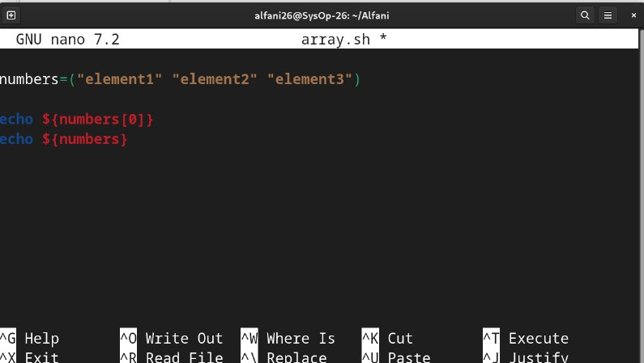
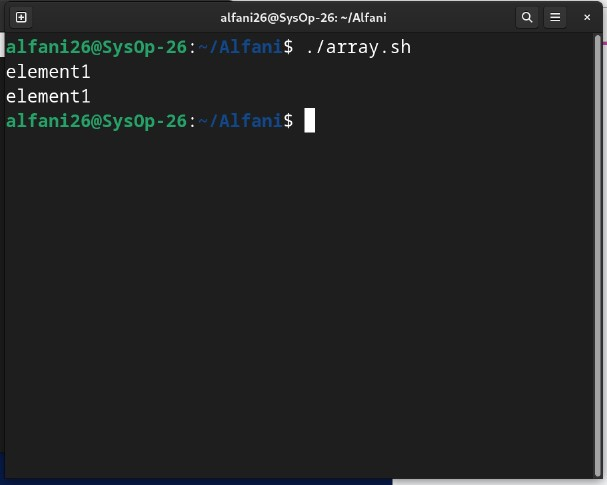

## Ale - Array 3

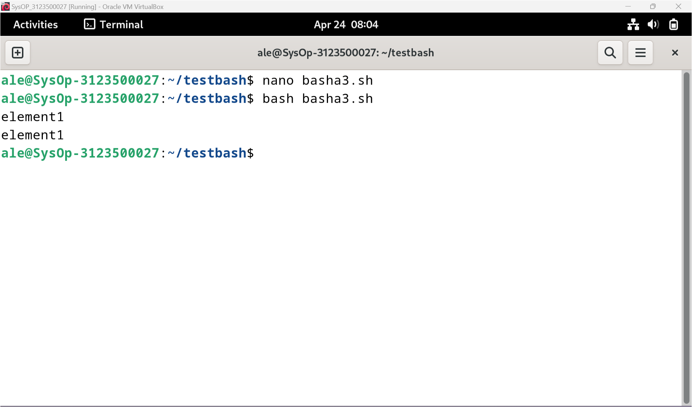

## Kanisius - Array 3


<h3>Mengambil elemen terakhir dari sebuah array</h3>
Dalam skrip bash, Anda dapat menggunakan indeks=-1 untuk mendapatkan elemen array terakhir.

```bash
numbers=("element1" "element2" "element3")
echo ${numbers[-1]}
```

Percobaan 4:
- [Alfani - Array 4](#Alfani---Array-4)
- [Ale - Array 4](#Ale---Array-4)
- [Kanisius - Array 4](#Kanisius---Array-4)

## Alfani - Array 4


## Ale - Array 4
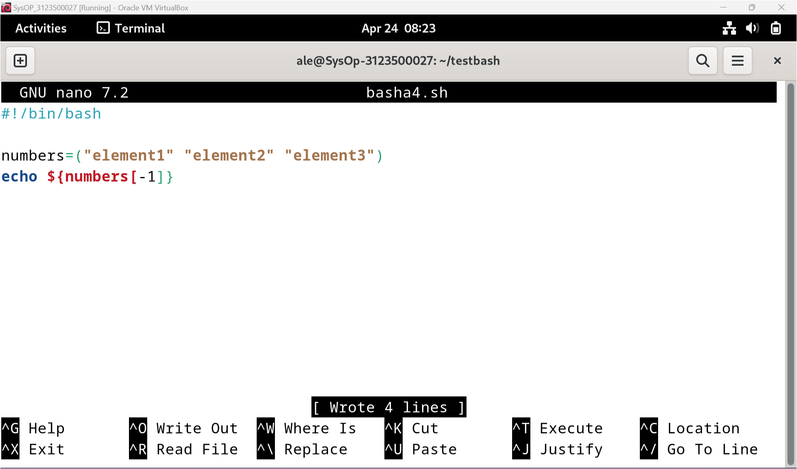


## Kanisius - Array 4

<h3>iterasi atau pengulangan elemen array</h3>
For loop digunakan untuk mengulangi elemen. 

Berikut adalah contoh contoh loop array untuk mencetak semua elemen:

```bash
numbers=("element1" "element2" "element3")

for i in "${numbers[@]}"
do
  echo "$i"
done
```

Output:

```bash
element1
element2
element3
```

Percobaan 5:
- [Alfani - Array 5](#Alfani---Array-5)
- [Ale - Array 5](#Ale---Array-5)
- [Kanisius - Array 5](#Kanisius---Array-5)

## Alfani - Array 5


## Ale - Array 5
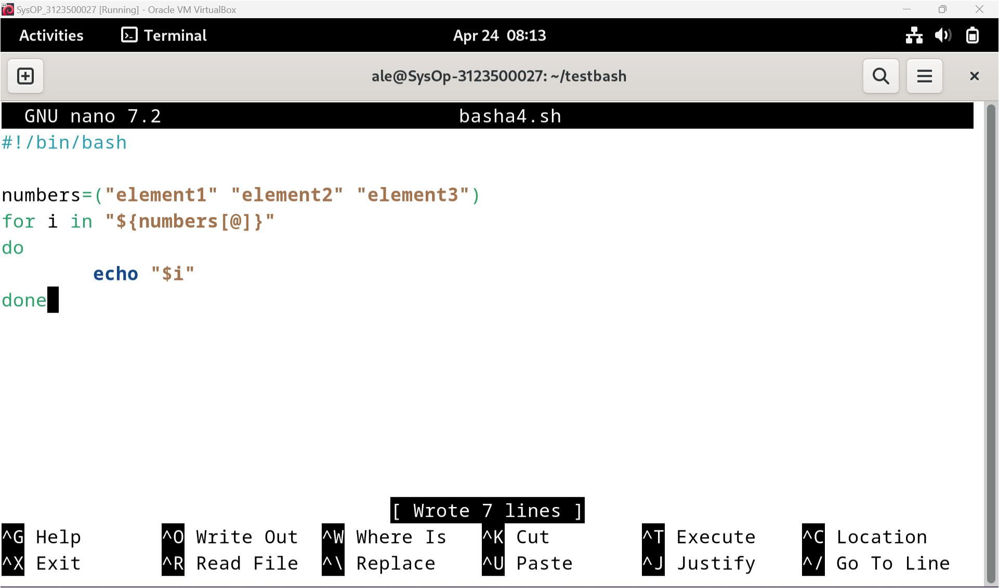


## Kanisius - Array 5

<h3>mencetak semua elemen array</h3>
Gunakan [@] atau [*] untuk mencetak semua elemen array.

```bash
arr=("element1" "element2" "element3") //
echo ${arr[@]} #element1 element2 element3
echo ${arr[*]}  #element1 element2 element3
```

Percobaan 6:
- [Alfani - Array 6](#Alfani---Array-6)
- [Ale - Array 6](#Ale---Array-6)
- [Kanisius - Array 6](#Kanisius---Array-6)

## Alfani - Array 6


## Ale - Array 6


## Kanisius - Array 6

<h3>Menghapus elemen dari array</h3>

Anda dapat menghapus elemen dari array menggunakan ```unset``` untuk indeks tertentu. 

```bash
numbers=("element1" "element2" "element3")
echo ${numbers[*]}
unset numbers[-1]
echo ${numbers[*]}
```

Percobaan 7:
- [Alfani - Array 7](#Alfani---Array-7)
- [Ale - Array 7](#Ale---Array-7)
- [Kanisius - Array 7](#Kanisius---Array-7)

## Alfani - Array 7

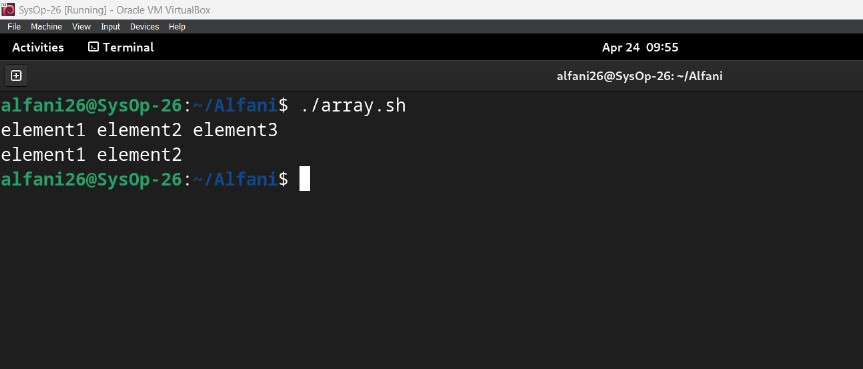

## Ale - Array 7


## Kanisius - Array 7

<h3>Menambahkan elemen ke array</h3>
Anda dapat menambahkan elemen di posisi indeks mana pun menggunakan sintaks di bawah ini:

```bash
array[index]=value
```

Contoh penambahan elemen awal dan akhir serta tengah:

```bash
numbers=("element1" "element2" "element3")
echo ${numbers[*]}

 numbers[0]="element0"
echo ${numbers[*]}
 numbers[5]="element5"
echo ${numbers[*]}
 numbers[6]="element6"
echo ${numbers[*]}
```

Output:

```bash
element1 element2 element3
element0 element2 element3
element0 element2 element3 element5
element0 element2 element3 element5 element6
```

Percobaan 8:
- [Alfani - Array 8](#Alfani---Array-8)
- [Ale - Array 8](#Ale---Array-8)
- [Kanisius - Array 8](#Kanisius---Array-8)

## Alfani - Array 8
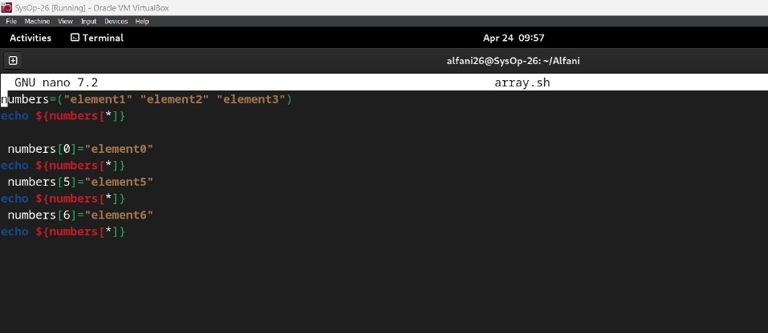


## Ale - Array 8
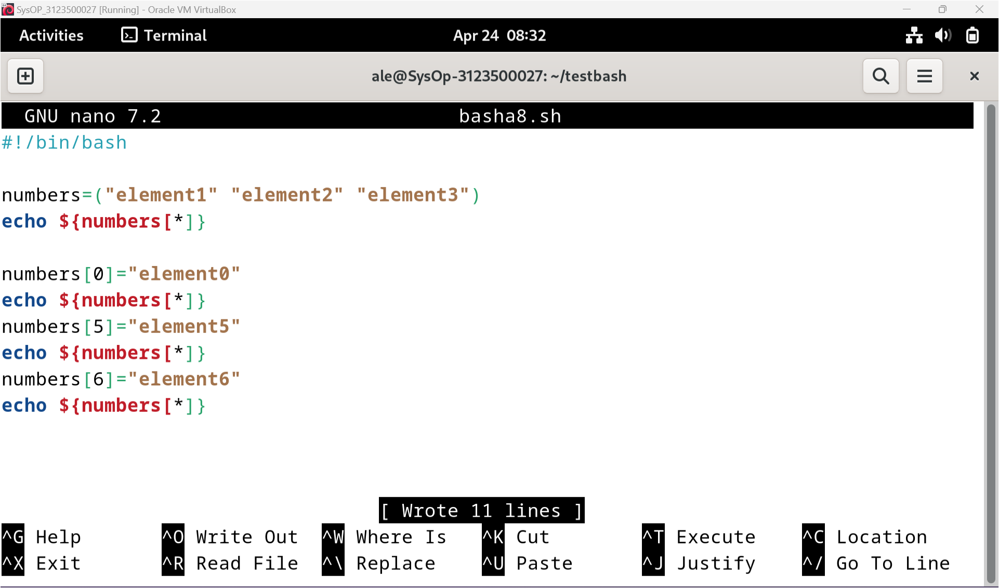
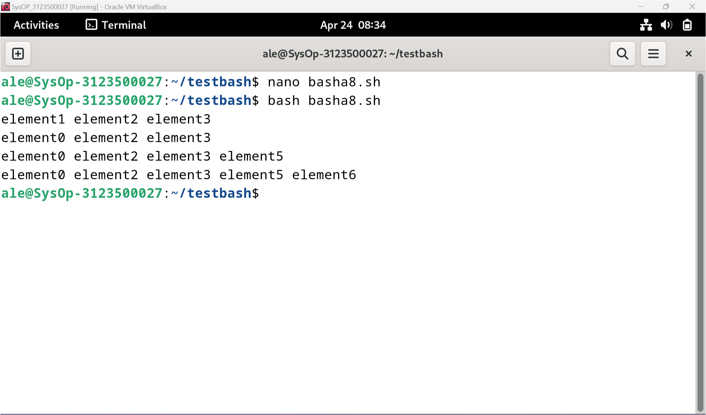

## Kanisius - Array 8


<h3>Panjang sebuah array</h3>
Dalam hal ini, Temukan jumlah semua elemen dalam array.

Skrip shell menyediakan # 

```bash
arr=("element1" "element2" "element3")
echo ${#arr[@]} # returns 3
echo ${#arr[*]} # returns 3
```

Percobaan 9:
- [Alfani - Array 9](#Alfani---Array-9)
- [Ale - Array 9](#Ale---Array-9)
- [Kanisius - Array 9](#Kanisius---Array-9)

## Alfani - Array 9


## Ale - Array 9

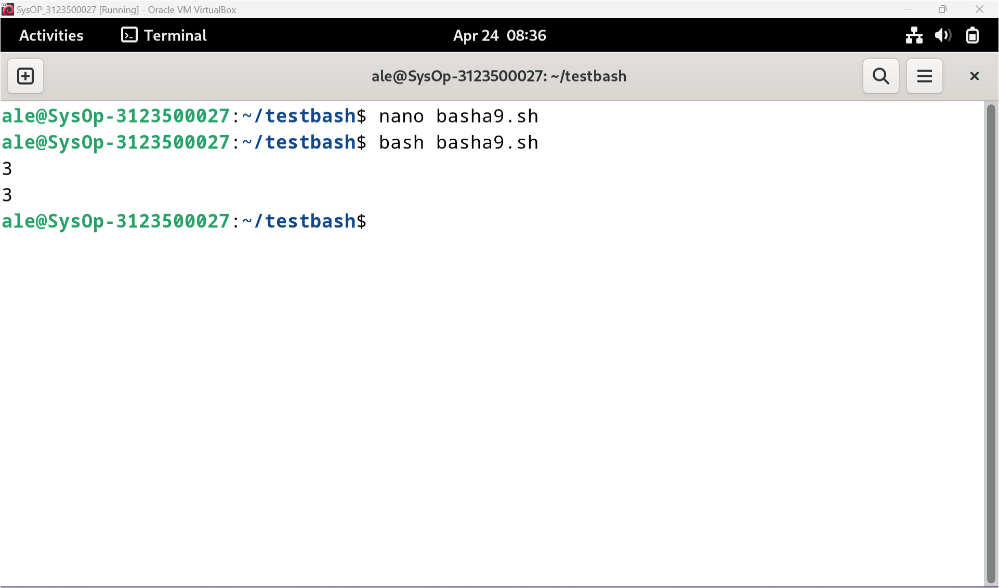

## Kanisius - Array 9

Contoh Array cheat sheet

Example | Description
---|---
declare -a array | Mendeklarasikan indexed array
declare -A array | Mendeklarasikan associated array
declare -a array=() | Mendeklarasikan array yang diindeks dengan array kosong
array=() | buat array kosong dengan menyatakan valid
array=(1 6 3) | Inisialisasi array dengan angka
array=(one two three)	| Inisialisasi array dengan string
array=(one two 1)	| Inisialisasi array dengan data campuran
${array[0]}	| Mengambil elemen pertama
${array[1]}	| Menagmbil elemen kedua
${array[-1]} | Mengambil elemen akhir
${array[@]} | Mengambil semua elemen
${array[*]}	| Mengambil semua elemen
${!array[!]} | Mengambil semua indeks
${#array[!]} | Menampilkan panjang array
array[0]=12 | Tambahkan elemen ke array di posisi pertama.yaitu indeks=0
array[-1]=22 | Tambahkan elemen ke array di posisi terakhir.
array+=(11) | Menambahkan nilai ke dalam sebuah array
${array[@]:k:i} | Mengambil elemen indeks=1 dimulai dari indeks=k

## Bash - Expansion
perintah dimasukkan ke OS untuk membuat panggilan sistem dan melakukan tindakan. perintah masukan pengguna di terminal untuk melakukan operasi seperti ls, cd, mkdir dll. 

Cara lain, Beberapa perintah dapat ditempatkan dalam satu file, juru bahasa bash membaca perintah dan menjalankannya

Cara menulis skrip shell di bash
- Pilih Editor atau editor teks
- Buat file dengan ekstensi .sh atau .bash
- Tulis perintah dalam file
- Simpan file sebagai hello.sh

```bash
#!/bin/bash
echo "Hello World"
```
Ubah izin untuk mengeksekusi file

```bash
chmod +x hello.sh
```

Percobaan 1:
- [Alfani - Expansion 1](#Alfani---Expansion-1)
- [Ale - Expansion 1](#Ale---Expansion-1)
- [Kanisius - Expansion 1](#Kanisius---Expansion-1)

## Alfani - Expansion 1

## Ale - Expansion 1
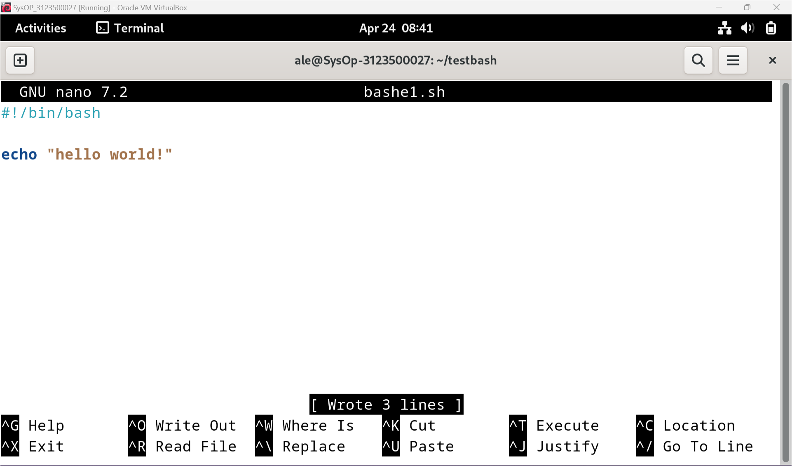
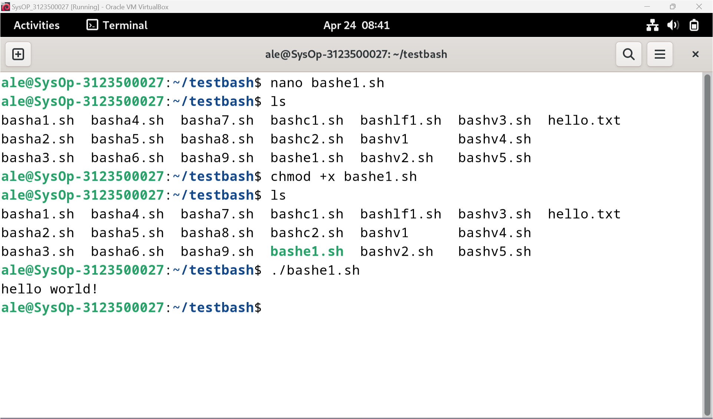

## Kanisius - Expansion 1


## Bash - Conditional Expression
Ekspresi kondisional dievaluasi pada waktu eksekusi skrip, berdasarkan hasil, Ini mengeksekusi blok perintah yang spesifik.

Ada berbagai jenis ekspresi kondisional di Bash:
- Operator Perbandingan String
- Operator Perbandingan Numerik
- Operator File
- Operator Logis 

<h3>Operator File</h3>
Bash menyediakan operator logika pada FIle dan direktori untuk menguji ekspresi kondisional. Ini memungkinkan Anda untuk memeriksa berbagai operasi seperti keberadaan, dan izin, ukuran. Ini digunakan ekspresi kondisional dalam pernyataan kondisional seperti if else dan case. 

sintaks:

```bash
if [[ conditiona_expressions]]; then
# code to handle
fi
```

conditiona_expressions berisi opsi, dan jalur file, yang selalu mengembalikan nilai benar atau salah.

berikut adalah opsi yang disediakan:

Operator | Keterangan
---|---
-e file	| Mengembalikan nilai benar jika file yang diberikan ada, file dapat berupa file atau direktori normal
-f file |	Mengembalikan nilai benar jika file yang diberikan ada dan file (bukan direktori)
-d file	| Mengembalikan nilai benar jika file adalah direktori
-r file	| Mengembalikan nilai benar jika file ada dan memiliki izin yang dapat dibaca
-w file	| Mengembalikan nilai benar jika file ada dan memiliki izin yang dapat ditulis
-x file	| Mengembalikan nilai benar jika file ada dan memiliki izin yang dapat dieksekusi
-s file	| Mengembalikan nilai benar jika file ada dan ukurannya tidak kosong
-G file	| Mengembalikan nilai benar jika file ada dan dimiliki oleh ID Grup yang cocok
-O file	| Mengembalikan nilai benar jika file ada dan dimiliki oleh ID pengguna yang cocok
-N file	| Mengembalikan nilai benar jika file ada dan diubah berdasarkan tanggal baca terakhir
-L file	| Mengembalikan nilai benar jika file ada dan merupakan Tautan simbolis
file1 -ot file2	| Mengembalikan nilai benar jika file1 lebih tua dari file2 atau file2 ada, file1 tidak ada
file1 -ne file2	| Mengembalikan nilai benar jika file1 lebih baru dari file2, file1 ada, file2 tidak ada
file1 -ef file2	| Mengembalikan nilai benar jika file1 dan file2 menunjuk ke perangkat dan inode yang sama 

## Bash - Case Statements
Case Statements mirip dengan switch case dalam bahasa pemrograman lain.

Ini digunakan untuk membandingkan masukan yang diberikan dengan a beberapa pola, dan perintah di dalam pola yang cocok dijalankan.

Sintaks:

```bash
case expression in

pattern1)
  ## Commands
  ;;
pattern1)
  ## Commands
  ;;
*)
  ## Default case to execute if none of the pattern is matched
  ;;
```

- expression adalah variabel atau ekspresi yang valid untuk dievaluasi.
- Ini berisi pola-pola yang didefinisikan di dalam kasus yang dievaluasi dengan membandingkan ekspresi, mencocokkan kasus yang ditemukan, lalu mengeksekusi perintah di dalamnya.
- kasus bawaan (```*)```) untuk dieksekusi jika tidak ada pola yang cocok.
- Setiap blok pola diakhiri dengan ```;;```.
- ```case``` adalah kata awal dan ```esac``` adalah sebuah kata yang mengakhiri pernyataan kasus.

Contoh dari Case Statements:

```bash
name="john1"

case $name in
    "john")
        echo "John."
        ;;
    "others" | "others2")
        echo "Other names."
        ;;

    *)
        echo "Default Name."
        ;;
esac
```

Percobaan 1:
- [Alfani - Case Statements 1](#Alfani---Case-Statements-1)
- [Ale - Case Statements 1](#Ale---Case-Statements-1)
- [Kanisius - Case Statements 1](#Kanisius---Case-Statements-1)

## Alfani - Case Statements 1

## Ale - Case Statements 1


## Kanisius - Case Statements 1


## Bash - Special Characters
Karakter khusus di bash dievaluasi dengan arti khusus dalam interpretasi suatu perintah. Karakter-karakter ini memiliki instruksi khusus, penggunaan karakter ini memiliki arti berbeda dalam konteks berbeda.

<h3>Blankspace (" “)</h3>
Ini juga disebut spasi putih, berisi tab, spasi, kembali, baris baru. Ini memberitahu penerjemah bash untuk memisahkan perintah dan konten. Ini adalah pembatas untuk memisahkan perintah dan string.

Contoh:
```bash
echo "Hello World"
```

Percobaan 1:
- [Alfani - Special Characters 1](#Alfani---Special-Characters-1)
- [Ale - Special Characters 1](#Ale---Special-Characters-1)
- [Kanisius - Special Characters 1](#Kanisius---Special-Characters-1)

## Alfani - Special Characters 1

## Ale - Special Characters 1

## Kanisius - Special Characters 1

<h3>Expansion ($)</h3>
simbol tanda dolar digunakan untuk berbagai jenis ekspansi perluasan parameter ( $variable, ${variable}), Substitusi ( $(expression)), ekspresi artema ( $((expression))).

<h3>Ambersand (&)</h3>
Menambahkan &di akhir perintah memungkinkan Anda menjalankan perintah di latar belakang. 

Misalnya, Untuk menjalankan server redis di latar belakang, gunakan perintah di bawah ini:
```bash
redis-server &
```

<h3>Pipe (|) </h3>
ni digunakan untuk meneruskan keluaran dari satu perintah ke masukan ke perintah lain dari kiri ke kanan. Hal ini memungkinkan untuk membentuk rantai perintah 

Sintaksnya adalah ```command1 | command2```

Contoh : ```echo "hello" | wc``` mengembalikan jumlah karakter.

<h3>Semicolon (;)</h3>

Ini digunakan untuk memisahkan beberapa perintah menggunakan ```;``` dalam satu baris. ```;``` adalah pemisah perintah untuk mendefinisikan beberapa perintah dalam satu baris.
Sintaks: 
```
command1; command2;command3
```

Contoh: ```cd /app/;ls;```

<h3>Single quotes</h3>

Kutipan tunggal (') digunakan untuk mendefinisikan string tanpa arti khusus. Artinya semua variabel dan ekspansi tidak diinterpretasikan dan mencetak string literal yang sama.

contoh:
```
name="Eric"

echo "Hi, $name"  # Hi, Eric
echo 'Hello, $name'  # Hi $name
```

echo pertama, variabel nama diperluas dan diinterpretasikan sebagai string dan dicetak.

echo kedua, menggunakan tanda kutip tunggal, dan variabel nama tidak diperluas dan dicetak sebagai string literal.

<h3>Double quotes</h3>
Tanda kutip ganda (") digunakan untuk mendefinisikan string literal dengan arti khusus.

jika string berisi variabel dan sintaks expansion, Ini diinterprestasikan dan diperluaskan, dengan nilai yang dievaluasi saat runtime.

Jika string tidak ingin memperluas variabel mereka, maka Anda dapat melewatkan karakter \ sebelum simbol $ dollar.

Contoh:
```
name="Eric"

echo "Hi, $name"  # Hi, Eric
echo "Hi, \$name"  # Hi, $name
```
echo pertama, variabel nama diperluas dan diinterpretasikan sebagai string dan dicetak.

echo kedua, karakter escape dengan awalan $ \, dicetak sebagai string literal.

<h3>Backslash Character (\)</h3>
Karakter backslash digunakan untuk menghindari karakter-karakter dalam string. Ini digunakan dalam string yang dikutip oleh tanda kutip ganda.

```
echo escape $$ example # escape 3225 example
echo escape \$$ example # escape $$ example
```

<h3>Comment (#)</h3>
Simbol komentar digunakan untuk mengomentari sebaris kode. Baris komentar selalu dimulai dengan #.

komentar akan diabaikan oleh penerjemah bash.
```
# Line comment
echo "comment example" # Inline comment
```

<h3>Tanda tanya (?)</h3>
tanda tanya mempunyai arti yang berbeda dalam konteksnya.

    Dalam konteks ekspresi reguler
    Di dalam 

periksa status keluar dari eksekusi perintah terakhir. 

<h3>Dot (.)</h3>
Titik dalam bash berguna untuk mengeksekusi file
## Kesimpulan.


## Referensi
